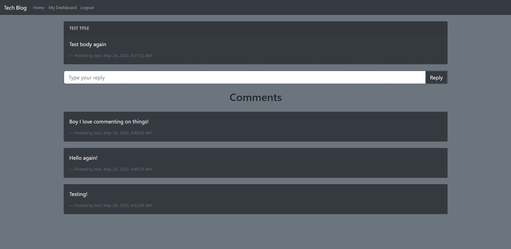

# Week 14 - Final Challenge - MVC Tech Blog

  A basic blog using CRUD commands  
  

  ## Description

  User can view posts and comments from other users. If they want to add their own input, then can sign up or sign in, and then begin posting as well. Information is securely stored, and the interface is intuitive and easy to follow.

  Screenshot of final output:  
  

  ## Table of Contents
  * [Dependencies](#dependencies)
  * [Installation](#installation)
  * [Executing Program](#execution)
  * [Authors](#authors)
  * [Questions](#questions)
  * [License](#license)
  * [Acknowledgements](#acknowledgements)
  * [Tests](#tests)

  Link to the repository:  
  https://github.com/dionkb/stunning-octo-dollop.git

  ## Getting Started

  ### Dependencies
  bcrypt, connect-session-sequelize, dotenv, express, express-handlebars, express-session, mysql2, sequelize, nodemon (dev-dependency)

  ### Installation
  N/A

  ## Usage

  ### Executing Program
  Follow the link below to the deployed application to begin using!
  
  Link to the deployed application:  
  https://sheltered-badlands-65127.herokuapp.com/

  ## Additional Information

  ### Authors
  Dion Baskara

  ### Questions
  For any questions, please reach out to me at dionkbaskara@gmail.com

  ### Contributing
  To help contribute to the project, reach out to me on Github.  
  There, you can report an issue if you encounter one.  
  GitHub profile: <a href="https://github.com/dionkb">Click Here</a>

  ### License  
  MIT License: For more information,  <a href="https://opensource.org/license/mit/">click here</a>  
  See also: LICENSE.md file located within directory (if applicable) 

  ### Acknowledgements
  MDN, W3Schools, and all of the documentation under the sun for each and every dependency used here

  ### Tests
  N/A
  
